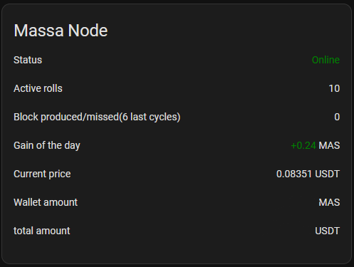

# Massa node card

This repository contains the card for home assistant, it's used to view the status of your Massa node.
This card work with the [massa_node](https://github.com/kevin-briand/massa_node) integration
This card has English/French translation

## Installation
### With HACS
- Go to the HACS panel
- select 3 dots in the top right corner > Custom repositories
- paste https://github.com/kevin-briand/massa-node-card and select plugin category
- find the massa-node-card integration in the list and download it
- reload the interface
- go to your dashboard > add card > select Massa Node Card

### Manual
To install this integration, follow these steps.
- copy massa-node-card.js in the dist folder to the /config/www/ folder in the home assistant
- add this card to the [resources path](https://developers.home-assistant.io/docs/frontend/custom-ui/registering-resources/)
- reload the interface
- go to your dashboard > add card > select Massa Node Card
